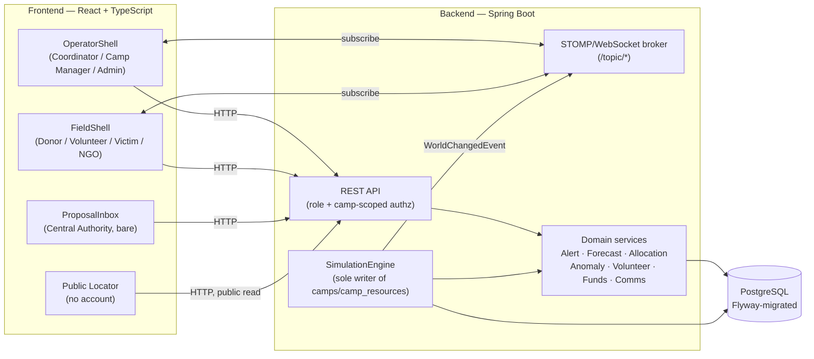

# Architecture

A showcase disaster-management system for two concurrent Bangladesh disasters (a Jamuna flood and
a Patuakhali cyclone), covering eight operational roles end to end: relief coordination, camp
management, allocation, forecasting, anomaly detection, volunteer matching, a donation ledger,
victim/family reunification, and central-authority approval of manually-proposed world changes.

## System shape

## Backend module map

Each package under `backend/src/main/java/bd/dms/` is one feature slice, added roughly in this
order (see `docs/README.md` and the ticket history in git log for the exact sequence):

| Package | Responsibility |
|---|---|
| `auth`, `security`, `user` | JWT auth, the eight `Role`s, role-routed authorization |
| `world` | Disasters, affected areas, camps — the read model of the simulated world |
| `sim` | `Scenario` (deterministic scripted world) + `SimulationEngine`, the **sole writer** of `camps`/`camp_resources` |
| `realtime` | STOMP topic wiring; topic names double as the access-control unit |
| `family` | Victim/family registration, dual-source arrival, reunification search |
| `alert` | Alert lifecycle (raise → transition → SLA re-escalation), generic threaded `note` |
| `forecast` | Rolling-rate forecasting with a confidence band, per data-quality condition |
| `allocation` | Cross-camp allocation scoring (severity/gap/surplus/priority) and the decision queue |
| `volunteer` | Scoring-based push-assign, self-accept, skill-gap routing |
| `funds` | Donation ledger, procurement, unaccounted-funds report |
| `anomaly` | Three rule-based detectors (allocation burst, duplicate registration, donation pattern) + review workspace |
| `broadcast`, `dm` | In-app communication: broadcasts and 1:1 threads along real operational relationships |
| `metrics` (test-only) | The ticket-14 validation harness output type — see below |

`db/migration/` carries the schema as sequential Flyway scripts (`V1__baseline.sql` through
`V15__anomaly_flags.sql` as of this ticket); each feature slice owns its own migration.

## Frontend module map

`frontend/src/` mirrors the backend slices: one directory per feature (`world`, `family`,
`alerts`, `forecasts`, `allocations`, `volunteers`, `funds`, `anomalies`, `comms`, `proposals`),
each holding an API client, a data hook, and a workspace component. Two shells route by role:
`shells/OperatorShell.tsx` (dark, dense, map-first — Coordinator/Camp Manager/Admin) and
`shells/FieldShell.tsx` (light, large-type, mobile-first — Donor/Volunteer/Victim/NGO).
`proposals/ProposalInbox.tsx` is a third, bare route for Central Authority — not built on either
shell (see `docs/responsible-design-note.md`). `routes/Locator.tsx` is the one public,
unauthenticated surface.

## The three test seams

See `docs/data-simulation-note.md` for how Seam 2 (the deterministic scenario) is built, and
`docs/metrics-report.md` for what the harness measures. In brief:

1. **API boundary** — Spring `@SpringBootTest` integration tests against real Postgres
   (Testcontainers), exercising the actual HTTP/STOMP surface.
2. **Deterministic scenario runner** — a headless, fixed-seed runner (`bd.dms.sim.Scenario`)
   drives quantitative gates: forecast MAE by data-quality condition, anomaly-detector
   precision/recall/false-positive rate and lead time, and the priority-vs-FCFS allocation
   comparison. `bd.dms.anomaly.MetricsReportGeneratorTest` consolidates all of these into one
   report (this ticket's main deliverable).
3. **Playwright smoke** — one path per role: sign in, land on the correct workspace, (for the
   operator shell) see the world on the map, toggle EN↔বাংলা and confirm strings change.

A separate, non-gating load-test track (`loadtest/`, k6) characterizes p50/p95 latency against a
running stack.
